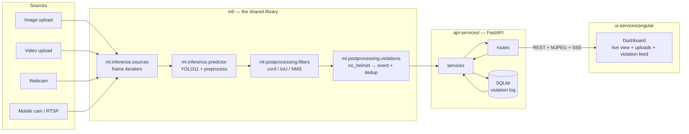

# Technical Design Document — Helmet Detection System

**Author:** Argha Dey Sarkar | **Date:** 2026-07-15 | **PRD:** `docs/requirements/PRD.md` | **Status:** Draft

> Phase 0 artifact. Every decision here traces to a PRD section; where the PRD has an open
> question, this document states the **provisional** choice and what would change it.
> Sections 2, 5, and 9 are the ones most likely to be invalidated by PRD open questions #1
> (GPU availability) and #2 (real head size in pixels).

---

## 1. Architecture Overview

**The load-bearing rule:** `ml/` owns detection and the violation business rule. `api-services/`
orchestrates and persists; it never re-implements inference. `ui-services/` talks only to the
API and never loads the model. This is what lets Phase 7 accuracy validation run *through* the
API and still measure the same thing the Phase 3 bare-model eval measured.

## 2. Model Selection & Rationale

| Sub-task | Chosen model | Alternatives considered | Why chosen |
|---|---|---|---|
| Head + helmet detection | **YOLO11n** (fine-tuned) | YOLO11s/m/l, RT-DETR, Faster R-CNN | Smallest model that can plausibly hit PRD §2.1/§2.2; per Phase 2.2, start small and scale only if Phase 3 says so. Mature Ultralytics tooling for training + export. |

**Pretrained vs fine-tuned:** fine-tuned from COCO-pretrained `yolo11n.pt`. Never from scratch
(Phase 2.3). COCO has a `person` class but no helmet concept, so the backbone transfers, the head
is retrained on two classes.

**Scale-up ladder, triggered only by Phase 3 error analysis:**

| If Phase 3 shows… | Then… |
|---|---|
| Small-object misses (heads < 32 px) | First raise `img_size` 640 → 960, **before** growing the model — cheaper and targets the actual failure |
| Recall shortfall on `no_helmet` across all sizes | YOLO11n → YOLO11s → YOLO11m |
| Confusion with caps/hairnets | More data + better annotation first (Phase 3.2 leverage order), not a bigger model |

⚠️ **Model family discrepancy — needs a decision.** The README and this TDD specify YOLO11. The
scaffold's config templates (`assets/templates/training.yaml`, `model_metadata.example.json`)
use `yolo26s.pt` as their example base weights. I have not verified what YOLO26 is or whether it
is a real, suitable, appropriately-licensed release, so I am **not** designing around it on the
strength of a template example. Before Phase 2, confirm: is YOLO11 the intended family, or has
the house standard moved to a newer release? If the latter, §2 and the license note below change.

**Licensing check:** Ultralytics YOLO11 is **AGPL-3.0** (PRD §6, open question #5). Acceptable
for an internal POC. If this is productized or deployed to a customer without publishing source,
it needs a commercial license or a permissively-licensed alternative (e.g. an RT-DETR variant).
**Decide before Phase 8, not during it.**

## 3. Data Pipeline Design

**Format:** YOLO detection format (one `.txt` per image: `class cx cy w h`, normalized).
Annotation tool exports YOLO directly; COCO export kept as a secondary for interop.

**Directory mapping:**

| Stage | Location | Produced by |
|---|---|---|
| Immutable source footage | `data/raw/videos/`, `data/raw/images/` | Manual collection (site) |
| Extracted frames | `data/interim/extracted_frames/` | `scripts/preprocessing/extract_frames.py` |
| Deduped / cleaned | `data/interim/cleaned/` | `scripts/preprocessing/clean_frames.py` |
| Annotations | `data/raw/annotations/` | Label Studio / CVAT export |
| Model-ready splits | `data/processed/{train,val,test}/` | `scripts/dataset_split/split_by_session.py` |
| Committed metadata | `data/metadata/` | `scripts/validation/*`, split script |

`data/raw/` is read-only. `data/processed/` must be fully regenerable from `data/raw/` by
re-running the scripts above — if it isn't, reproducibility is gone.

**Frame extraction:** sample at ~1–2 FPS, not every frame. Consecutive frames at 30 FPS are
near-duplicates: they inflate dataset size, add near-zero information, and are the main vector
for split leakage.

**Annotation workflow:**

1. Write `docs/workflow/annotation_guidelines.md` **before** labeling — it must resolve at
   minimum: helmet carried-not-worn (→ not `helmet`), partially occluded heads (→ label if the
   head is identifiable), heads at the frame edge, motion-blurred heads, and hard-hat-like
   confusers (caps, hairnets → `no_helmet`).
2. Label boxes on the **head region**, not the whole person (PRD §3).
3. Auto-label assist: once M1's baseline model exists, pre-annotate with it and have humans
   correct — much faster than labeling from scratch. **Caveat:** this biases labels toward what
   the model already believes and will silently hide its blind spots. Never auto-label the
   **test** split; label it by hand.
4. Review: second-pass QC on a sample via `scripts/validation/check_annotations.py`.

**Split strategy:** `by_session` — group by source video / capture session, assign whole groups
to train/val/test at 80/10/10. **Never random-frame.** Split file lists (`train.txt`, `val.txt`,
`test.txt`) are committed to `data/metadata/` because they're small and define the experiment.

Additional constraint beyond the template default: the **test split must contain `no_helmet`
instances from at least one session that contributes no frames to train**. Otherwise the test
set measures memorization of a session, not generalization to a new scene.

**Augmentation policy** (mirrors `configs/training.yaml`):

| Aug | Setting | Rationale |
|---|---|---|
| `fliplr` | 0.5 | Safe — helmets are horizontally symmetric |
| `flipud` | **0.0 — disabled** | Camera orientation is fixed on site; upside-down heads never occur. Training on them wastes capacity |
| `mosaic` | 1.0 | Strong regularizer, helps small-object and crowding cases |
| `mixup` | 0.1 | Mild; blended heads are semantically incoherent for this task |
| `hsv_h/s/v` | 0.015 / 0.7 / 0.4 | Covers varied factory lighting and helmet colors |
| `degrees` | ±10 | Slight camera tilt / head tilt only |
| `perspective` | 0.0005 | Minimal — fixed camera geometry |
| `blur`, `noise` | light | Matches motion blur and CCTV compression (PRD §5 edge cases) |

**Do not** augment helmet color aggressively in a way that invents colors the site never uses if
the site standardizes on one color — but **do** keep HSV wide if colors vary. Confirm against
real footage at M1.

**Dataset versioning:** dated, immutable prefixes in cloud/on-prem object storage
(`helmet-poc-v1/`, `v2/`, …). `data/metadata/dataset_info.json` names the exact version a model
trained on. Given PRD §5 privacy constraints (open question #3), storage may be required to be
on-prem — resolve before uploading footage anywhere.

## 4. Training Design

- **Framework:** Ultralytics (PyTorch). **Base weights:** `yolo11n.pt` (COCO).
- **Environment:** Google Colab T4 / Kaggle, per the Cloud GPU Workflow. Code CPU-smoke-tested
  locally on a tiny sample first (`tests/integration/`), pushed to GitHub, cloned on the GPU box.
- **Experiment tracking:** Weights & Biases (`tracking.backend: wandb`), project `helmet-detection`.
  ⚠️ If PRD open question #3 lands on on-prem-only, W&B image logging would upload factory frames
  to a third party — disable media logging or use `backend: none` / local MLflow.

**Key hyperparameters** (mirrors `configs/training.yaml`, never hardcoded):

| Key | Value | Note |
|---|---|---|
| `epochs` | 100 | With early stopping (`patience: 20`) |
| `batch_size` | 16 | T4-appropriate for YOLO11n @ 640 |
| `img_size` | 640 | Raise to 960 if M1 shows heads < 32 px (§2) |
| `lr` | 0.001 | Ultralytics default schedule |
| `optimizer` | auto (SGD) | |
| `seed` | 42 | Fixed for reproducibility |
| `base_weights` | `yolo11n.pt` | |

**Class imbalance is the expected problem here.** A compliant factory yields far more `helmet`
than `no_helmet` (PRD open question #4). Mitigations in leverage order: (1) collect/stage more
`no_helmet` footage — by far the most effective; (2) oversample `no_helmet`-containing frames in
the train split; (3) only if those fail, consider loss weighting. Do **not** reach for focal-loss
tuning to paper over a dataset that has 40 violation examples.

**Checkpoint/export policy:** every run writes `best.pt` + `last.pt` + logs to
`artifacts/checkpoints/<version>/` and to cloud/on-prem storage — never left only on the
ephemeral Colab machine. Exports to `artifacts/exported_models/` with versioned filenames.
Each run produces `artifacts/experiment_results/<version>/metadata.json` (**committed**) per the
template: version, git commit, dataset version, hyperparameters, metrics with the eval set named,
exports, and known failure notes. Only the promoted model is copied to `ml/models/best.pt`.

## 5. Evaluation Design

**Primary metric:** mAP50 ≥ 0.85 — but the **gating** metrics are per-class `no_helmet`
precision ≥ 0.90 and recall ≥ 0.90 (PRD §2.1). Report both; gate on both.

**Evaluation slices** — aggregate numbers hide exactly the failures that matter:

| Slice | Why |
|---|---|
| Per class (`helmet` vs `no_helmet`) | The minority class is the decision-critical one |
| By head size (< 32 px / 32–96 px / > 96 px) | Validates or kills the PRD §4 distance assumption |
| By lighting (bright / dim / backlit) | Backlighting is a predicted failure mode |
| By occlusion (clear / partial) | Machinery occlusion is endemic on a factory floor |
| By session / camera | Detects whether the model learned a scene rather than the task |
| Negative samples (no people / all compliant) | Directly measures the ≤5% false-alarm target |

**Operating threshold selection:** do **not** ship the F1-optimal threshold. Per PRD §7, sweep
confidence on the **val** PR curve, then pick the lowest threshold that still holds
`no_helmet` precision ≥ 0.90, maximizing recall subject to that floor. Record the chosen value in
`configs/inference.yaml` (`conf_threshold`) and the sweep in `docs/reports/`. Selecting the
threshold on **test** would contaminate the acceptance measurement — use val.

Two separable thresholds (PRD §7): `conf_threshold` for detection/logging, and a distinct
`alert_conf_threshold` for what escalates to the supervisor feed, so audit logs can be more
conservative than live alerts.

**Latency benchmark protocol** (`tests/performance/`): 100 warmup + 500 timed single-image
inferences at 640px on the actual target machine; report p50/p95/p99 end-to-end through the API
(not bare model — preprocessing and serialization are real cost), plus sustained FPS over a
60-second stream. Recorded in `metadata.json` and `docs/reports/`.

## 6. Module Design (`ml/` layout)

| Module | Responsibility | Key public functions/classes |
|---|---|---|
| `ml/training/` | Fine-tune YOLO11 from `configs/training.yaml`; write run artifacts + metadata.json | `train(config) -> RunResult`, `write_run_metadata(run, path)` |
| `ml/inference/` | Load blessed model once; produce raw detections from any source | `HelmetDetector(config)` with `.predict(image) -> list[Detection]`; `sources.iter_frames(spec) -> Iterator[Frame]` covering image/video/webcam/RTSP |
| `ml/evaluation/` | Test-split metrics, per-slice breakdown, PR curves, threshold sweep | `evaluate(model, split, slices) -> EvalReport`, `sweep_threshold(...) -> pd.DataFrame` |
| `ml/postprocessing/` | Confidence/IoU/NMS filtering; the violation business rule + dedup | `filters.apply(detections, config) -> list[Detection]`; `violations.ViolationTracker.update(detections, ts) -> list[ViolationEvent]` |

**Core types** (`ml/types.py`): `Detection(cls, conf, xyxy)`, `Frame(image, ts, source_id)`,
`ViolationEvent(ts, box, conf, frame_ref, source_id)`.

**`ViolationTracker` — the dedup design, and its honest limitation.** v1 has no tracking
(PRD §3), so a stationary non-compliant worker would emit a violation every frame. Dedup rule:
keep a time-windowed deque of recent violation boxes; suppress a new `no_helmet` detection if it
has IoU ≥ 0.5 with a violation emitted within the last `dedup_window_seconds` (default 30).

This is deliberately poor-man's tracking, and it is wrong in two known ways: a worker who **moves
across the frame** re-triggers (IoU drops), and two workers standing in nearly the same spot
**merge** into one event. Both are acceptable for a POC that answers "can we detect helmets";
neither is acceptable for per-worker attribution, which is exactly why tracking is v2 scope. This
limitation goes in `docs/reports/` and the README — not discovered by a supervisor in month two.

**Entry points** stay thin: `scripts/` parses args and calls into `ml/`; no pipeline logic there.

## 7. Configuration

New/changed keys beyond the scaffold defaults:

**`configs/data.yaml`**

| Key | Type | Default | Purpose |
|---|---|---|---|
| `split.strategy` | str | `by_session` | Leakage guard (scaffold default — correct as-is) |
| `classes_file` | str | `data/metadata/class_names.txt` | Contains exactly: `helmet`, `no_helmet` |
| `frame_sample_fps` | float | `1.5` | **New** — extraction rate for `scripts/preprocessing/` |

**`configs/training.yaml`**

| Key | Type | Default | Purpose |
|---|---|---|---|
| `base_weights` | str | `yolo11n.pt` | **Changed** from template's `null`/`yolo26s.pt` (§2) |
| `patience` | int | `20` | **New** — early stopping |
| `augmentation.flipud` | float | `0.0` | **New, explicit** — documented disable (§3) |
| `augmentation.mixup` | float | `0.1` | **New** |
| `augmentation.hsv_h/s/v` | float | `0.015/0.7/0.4` | **New** |
| `augmentation.degrees` | float | `10.0` | **New** |
| `tracking.project` | str | `helmet-detection` | W&B project |

**`configs/inference.yaml`**

| Key | Type | Default | Purpose |
|---|---|---|---|
| `model_weights` | str | `ml/models/best.pt` | Blessed model (scaffold default) |
| `conf_threshold` | float | `0.35` | **Provisional** — set from the val sweep in Phase 3 (§5) |
| `alert_conf_threshold` | float | `0.35` | **New** — separate escalation threshold (PRD §7) |
| `iou_threshold` | float | `0.5` | NMS IoU |
| `img_size` | int | `640` | Raise to 960 if M1 finds small heads |
| `device` | str | `auto` | Falls back to CPU — see risk R1 |
| `dedup_window_seconds` | int | `30` | **New** — violation dedup window (§6) |
| `dedup_iou` | float | `0.5` | **New** — dedup spatial match |

**`configs/api.yaml`**

| Key | Type | Default | Purpose |
|---|---|---|---|
| `cors_allowed_origins` | list | `["http://localhost:4200"]` | Angular dev server (scaffold default already correct) |
| `max_upload_mb` | int | `100` | **New** — video upload cap |
| `video_max_duration_seconds` | int | `120` | **New** — bounds sync processing time |

**`api-services/config/.env`** (secrets/per-deployment; `.env.example` committed)

| Var | Default | Purpose |
|---|---|---|
| `API_HOST` / `API_PORT` | `0.0.0.0` / `8000` | Scaffold defaults |
| `CAMERA_URL` | *(empty)* | RTSP/mobile-cam URL — **secret**, contains credentials |
| `LOG_LEVEL` | `INFO` | |
| `VIOLATION_DB_URL` | `sqlite:///outputs/violations.db` | **New** — event store (§8) |

## 8. API / Integration Design

Base path `/api/v1`. Services orchestrate `ml.inference` → `ml.postprocessing`; routes stay thin.

| Endpoint | Method | Request | Response |
|---|---|---|---|
| `/health` | GET | — | `{status, model_version, model_loaded, device, uptime_s}` — must report the **promoted model version** (Phase 5 gate) |
| `/detect/image` | POST | multipart image | `{detections: [{cls, conf, xyxy}], inference_ms, image_id}` |
| `/detect/image?annotated=true` | POST | multipart image | `image/jpeg` with boxes drawn |
| `/detect/video` | POST | multipart video | `{job_id}` → async; bounded by `video_max_duration_seconds` |
| `/detect/video/{job_id}` | GET | — | `{status, progress, detections_summary, output_path}` |
| `/stream/start` | POST | `{source: "webcam"\|"rtsp", url?}` | `{stream_id, status}` |
| `/stream/stop` | POST | `{stream_id}` | `{stream_id, status}` |
| `/stream/status` | GET | — | `{stream_id, status, fps, frames_processed, dropped}` |
| `/stream/live.mjpg` | GET | — | `multipart/x-mixed-replace` annotated MJPEG — the dashboard's live view |
| `/violations/feed` | GET | — | **SSE** stream of `ViolationEvent` — pushes alerts to the supervisor |
| `/violations` | GET | `?from&to&page&page_size` | Paginated violation log for audit reporting |

**Design notes:**

- **MJPEG for live video, SSE for events.** Both are one-way server→browser, need no extra
  protocol, and are trivial to consume from Angular. WebSockets would buy bidirectionality this
  POC doesn't need.
- **Video is async** (`job_id`), because a 2-minute clip at ~10 FPS on a laptop takes well over
  any sane HTTP timeout. Image detection stays synchronous.
- **Model loads once at startup**, not per request — per-request loading would blow the §2.2
  latency budget by an order of magnitude. Health check reports readiness.
- **Storage:** SQLite via `VIOLATION_DB_URL`, single table `violations` (id, ts, source_id,
  conf, box, frame_path). Append-only. Sufficient for POC; PRD open question #6.
- **Error handling:** 400 for unsupported media/oversized upload, 422 for schema violations, 503
  when the model isn't loaded or a stream source is unreachable, 404 for unknown `job_id`/`stream_id`.
  Errors return `{error, detail}`.
- **Auth:** none in v1 (PRD §8, out of scope). Bind to localhost. This is a POC on a dev machine;
  it must not be exposed to a network in this state, and that warning belongs in the deployment doc.

## 9. Deployment Design

- **Target:** local dev machine (PRD §6). Docker Compose with three services: `api` (FastAPI +
  `ml/`), `ui` (Angular, nginx-served build), `ai` (training image, CUDA base — used only for
  local training experiments, not part of the demo stack).
- **Export path:** PyTorch `.pt` is sufficient for the POC target. ONNX export is produced and
  archived per run for portability, but the API serves `.pt`. **No TensorRT** — that's a Jetson
  concern and this isn't a Jetson (revisit if PRD open question #1 changes the target).
- **Quantization:** none in v1. INT8 is an edge-deployment optimization; on a laptop GPU it buys
  little and costs accuracy that PRD §2.1 has no headroom for.
- **GPU passthrough:** `api` service needs `--gpus all` (Compose `deploy.resources.reservations.devices`)
  and an NVIDIA base image if the GPU is used. **If open question #1 resolves to CPU-only**, drop
  to a slim CPU base and renegotiate §2.2 (see R1).
- **Resource limits:** POC-grade — no hard limits, but the `api` container holds the model in
  memory (~10 MB for YOLO11n weights, ~1–2 GB CUDA context).
- **Docker image contents:** `api` builds from `api-services/requirements.txt` — the scoped
  export, which must **not** drag in training-only deps (`albumentations`, W&B). Regenerate both
  requirements files with `uv export`, never hand-edit.

## 10. Testing Plan

| Tier | Location | Covers |
|---|---|---|
| **Unit** | `ml/tests/` | Pure logic, no GPU: box IoU/geometry, YOLO↔COCO conversion, `filters.apply` threshold/NMS behavior, **`ViolationTracker` dedup** (fires once inside the window, re-fires after it, suppresses on IoU ≥ 0.5, emits separately below it), config loading, threshold sweep math |
| **Unit** | `api-services/tests/` | Route handlers with a **stubbed** detector, schema validation, error codes, pagination |
| **Integration** | `tests/integration/` | Preprocessing → split over fixture images (leakage assertion: no session in two splits); API → real `ml.inference` on a tiny model |
| **Performance** | `tests/performance/` | §5 latency protocol vs. PRD §2.2 |
| **E2E / smoke** | `tests/end_to_end/` | Real `ml/models/best.pt` + 2–3 fixture images through the full API path; assert output **shape/type/range sanity**, not exact values |

`ViolationTracker` is the highest-value unit-test target: it's pure logic, it encodes the
business rule, and its bugs are invisible in aggregate metrics.

**Fixtures:** 2–3 tiny images in `tests/fixtures/` (committed) — must include one `no_helmet`,
one compliant, one empty scene. ⚠️ Fixture images of real workers inherit PRD open question #3's
privacy constraints; use consented/synthetic frames or blur non-target faces before committing,
because committed fixtures are permanent in git history.

Run E2E after **every** model promotion and before every deployment — that's what catches broken
exports and preprocessing drift.

## 11. Monitoring & Feedback Loop

**Logged** (via `configs/logging.yaml`, to `outputs/logs/`):

- Startup (`INFO`): model version, device, resolved config — the first question in any incident
  is "what was actually running"
- Per-request (`INFO`): endpoint, inference latency, detection count
- Periodic (`INFO`): rolling FPS and dropped-frame count during streams
- (`WARNING`): frame decode failure, dropped frames, stream reconnect attempts
- (`ERROR`): camera unreachable after retries, inference exception
- Never `print()`.

**Drift signals to watch:** violation rate per hour deviating sharply from baseline (usually a
camera/lighting change, not a behavior change); mean confidence trending down; dropped-frame rate
rising; a sudden run of near-threshold detections.

**Hard-case capture — the flywheel:** persist frames where detections land near the threshold
(`conf` within ±0.1 of `conf_threshold`) and any frame a supervisor marks as a false alarm in the
dashboard, to `outputs/inference/hard_cases/`. These are the highest-value candidates for the
next annotation round — they're precisely the examples the model is worst at. A dashboard
"this was wrong" button is cheap and turns supervisors into labelers.

## 12. Risks & Mitigations

| # | Risk | Likelihood | Impact | Mitigation |
|---|---|---|---|---|
| **R1** | **Dev machine is CPU-only** → §2.2's ≥10 FPS live target is unreachable (YOLO11n on CPU ≈ 100–250 ms/frame) | Medium | High | Resolve PRD open question #1 **before Phase 2**. Fallback: process every Nth frame for live view and renegotiate the FPS target; image/video detection still meet budget |
| **R2** | **Too few `no_helmet` examples** — a compliant factory rarely produces the minority class, capping recall | **High** | **High** | Stage violations deliberately during collection (workers removing helmets in a controlled setting); oversample; treat as an M2 gate, not an M3 surprise |
| **R3** | **Heads too small at real camera distance** (< 32 px) → n-model at 640 misses them | Medium | High | Validate at **M1** on real footage before annotating; mitigate with `img_size` 960 first, then a larger model |
| **R4** | **Split leakage via near-duplicate frames** → §2.1 metrics look great, model fails in reality | Medium | **Critical** | `by_session` split + low-FPS extraction + an integration test asserting no session spans splits. This is the failure that makes every other number a lie |
| **R5** | **AGPL-3.0** blocks productization discovered late | Medium | High | Decide PRD open question #5 before Phase 8; RT-DETR is the escape hatch but would force retraining |
| **R6** | **Privacy/consent** blocks use of factory footage after collection | Medium | **Critical** | Resolve PRD open question #3 **before** collecting — this can invalidate the entire dataset and it's free to settle now |
| **R7** | **Angular dashboard consumes the schedule** — far more effort than a Streamlit POC UI for the same evidence | **High** | Medium | PRD open question #7. If M3 slips, descope to Streamlit; the API contract (§8) is UI-agnostic, so this swap stays cheap |
| **R8** | **No tracking** → duplicate/merged violation events confuse supervisors | High | Low (v1) | Documented dedup limitation (§6); tracking is v2 scope; state it plainly in the README |
| **R9** | **Auto-labeling with M1's model** bakes the baseline's blind spots into the dataset | Medium | Medium | Never auto-label the test split; human-review every auto-labeled train frame |
| **R10** | **Domain gap** — model learns one session's lighting/scene | Medium | High | Multi-session collection; per-session eval slice (§5) surfaces it |

The three worth acting on **this week**, because they're free now and expensive later: **R6**
(consent — can invalidate all collected data), **R2** (violation examples — shapes what you
capture), **R1** (GPU — determines whether §2.2 is fiction).

---
_Phase 0 gate: PRD + TDD complete. Next: scaffold the repo (`scripts/init_cv_project.py`), then Phase 1._
